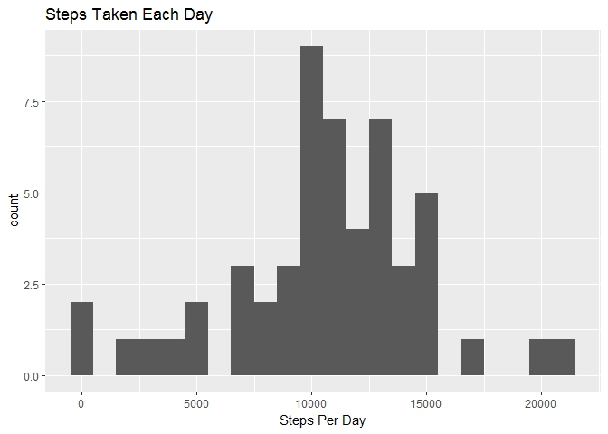
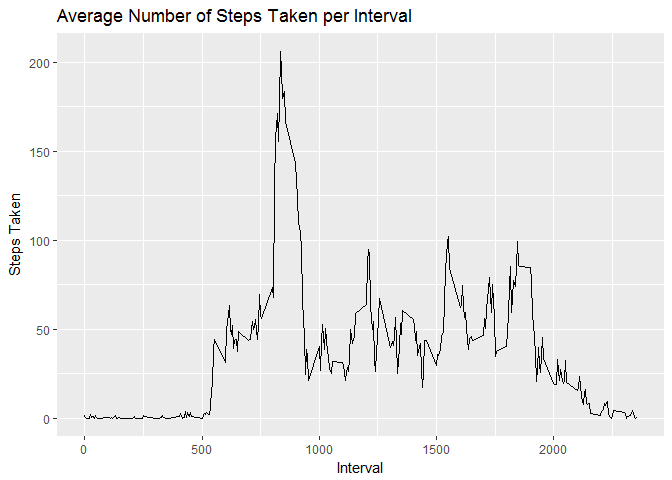
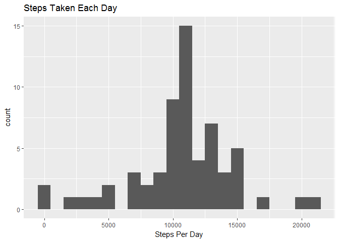
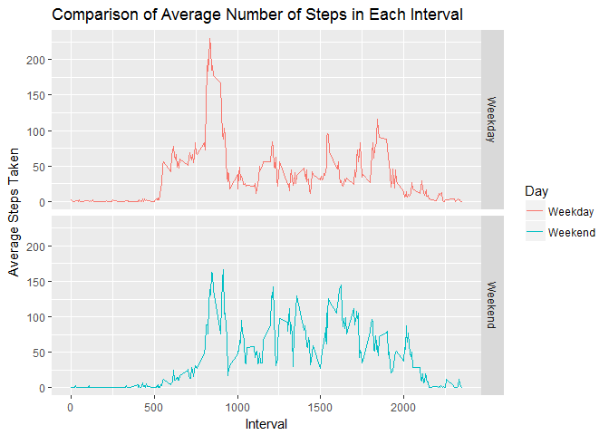

Loading & preprocessing the data
--------------------------------

1.  Load the data

<!-- -->

    URL <- "https://d396qusza40orc.cloudfront.net/repdata%2Fdata%2Factivity.zip"
    filename_zip <- "repdata%2Fdata%2Factivity.zip"
    filename_csv <- "activity.csv"

    if(!file.exists(filename_zip)) {
      download.file(URL, filename_zip, mode="wb")
    }

    if(!file.exists(filename_csv)) {
      unzip(filename_zip)
    }

    data <- read.csv(filename_csv)

1.  Process/transform the data (if necessary) into a format suitable for
    your analysis

<!-- -->

    summary(data)

    ##      steps                date          interval     
    ##  Min.   :  0.00   2012-10-01:  288   Min.   :   0.0  
    ##  1st Qu.:  0.00   2012-10-02:  288   1st Qu.: 588.8  
    ##  Median :  0.00   2012-10-03:  288   Median :1177.5  
    ##  Mean   : 37.38   2012-10-04:  288   Mean   :1177.5  
    ##  3rd Qu.: 12.00   2012-10-05:  288   3rd Qu.:1766.2  
    ##  Max.   :806.00   2012-10-06:  288   Max.   :2355.0  
    ##  NA's   :2304     (Other)   :15840

What is mean total number of steps taken per day?
-------------------------------------------------

1.  Calculate the total number of steps taken per day

<!-- -->

    steps_per_day <- aggregate(steps ~ date, data, sum, na.rm=TRUE)

1.  Make a histogram of the total number of steps taken each day

<!-- -->

    qplot(steps_per_day$steps, main ="Steps Taken Each Day", xlab = "Steps Per Day", binwidth=1000)

1.  Calculate and report the mean and median of the total number of
    steps taken per day

<!-- -->

    mean(steps_per_day$steps)

    ## [1] 10766.19

    median(steps_per_day$steps)

    ## [1] 10765

What is the average daily activity pattern?
-------------------------------------------

1.  Make a time series plot (i.e. type="l" of the 5-minute
    interval (x-axis) and the average number of steps taken, averaged
    across all days (y-axis)

<!-- -->

    average_steps <- aggregate(steps ~ interval, data, mean, na.rm=TRUE)
    ggplot(data=average_steps, aes(x=interval, y=steps)) +
      geom_line() +
      xlab("Interval") +
      ylab("Steps Taken") +
      ggtitle("Average Number of Steps Taken per Interval")

1.  Which 5-minute interval, on average across all the days in the
    dataset, contains the maximum number of steps?

<!-- -->

    average_steps[which.max(average_steps$steps),]

    ##     interval    steps
    ## 104      835 206.1698

Imputing missing values
-----------------------

1.  Calculate and report the total number of missing values in the
    dataset (i.e. the total number of rows with NAs)

<!-- -->

    sapply(X = data, FUN = function(x) 
      sum(is.na(x)))

    ##    steps     date interval 
    ##     2304        0        0

1.  Devise a strategy for filling in all of the missing values in
    the dataset. The strategy does not need to be sophisticated. For
    example, you could use the mean/median for that day, or the mean for
    that 5-minute interval, etc.
2.  Create a new dataset that is equal to the original dataset but with
    the missing data filled in.

Some days have no data, therefore use average steps per interval to fill
the NAs.

    replacewithmean <- function(x) replace(x, is.na(x), mean(x, na.rm=TRUE))
    meanbyinterval <- data %>%
      group_by(interval) %>%
      mutate(steps = replacewithmean(steps))

    ## Warning: package 'bindrcpp' was built under R version 3.4.3

    head(meanbyinterval)

    ## # A tibble: 6 x 3
    ## # Groups:   interval [6]
    ##       steps       date interval
    ##       <dbl>     <fctr>    <int>
    ## 1 1.7169811 2012-10-01        0
    ## 2 0.3396226 2012-10-01        5
    ## 3 0.1320755 2012-10-01       10
    ## 4 0.1509434 2012-10-01       15
    ## 5 0.0754717 2012-10-01       20
    ## 6 2.0943396 2012-10-01       25

1.  Make a histogram of the total number of steps taken each day and
    Calculate and report the mean and median total number of steps taken
    per day.

<!-- -->

    imputed.steps_per_day <- aggregate(steps ~ date, meanbyinterval, sum)
    qplot(imputed.steps_per_day$steps, main ="Steps Taken Each Day", xlab = "Steps Per Day", binwidth=1000)

    mean(imputed.steps_per_day$steps)

    ## [1] 10766.19

    median(imputed.steps_per_day$steps)

    ## [1] 10766.19

Do these values differ from the estimates from the first part of the
assignment? What is the impact of imputing missing data on the estimates
of the total daily number of steps?

    # The values differ from the first set of estimates. 
    # Imputing missing data provides a slight overestimate of the median of the total daily number of steps and push it towards the mean value.

Are there differences in activity patterns between weekdays and weekends?
-------------------------------------------------------------------------

1.  Create a new factor variable in the dataset with two levels -
    "weekday" and "weekend" indicating whether a given date is a weekday
    or weekend day.

<!-- -->

    meanbyinterval$date <- as.Date(meanbyinterval$date)
    meanbyinterval$weekday <- weekdays(meanbyinterval$date)
    meanbyinterval$day <- ifelse(meanbyinterval$weekday == "Saturday" | meanbyinterval$weekday == "Sunday", "Weekend", "Weekday")

1.  Make a panel plot containing a time series plot of the 5-minute
    interval (x-axis) and the average number of steps taken, averaged
    across all weekday days or weekend days (y-axis). See the README
    file in the GitHub repository to see an example of what this plot
    should look like using simulated data.

<!-- -->

    meanbyintervalbyday <- aggregate(meanbyinterval$steps, list(meanbyinterval$interval, meanbyinterval$day), mean)
    names(meanbyintervalbyday) <- c("interval","day","steps")

    ggplot(data = meanbyintervalbyday, aes(x=interval, y=steps, color=day)) +
      geom_line() +
      facet_grid(day~.) +
      xlab("Interval") +
      ylab("Average Steps Taken") +
      ggtitle("Comparison of Average Number of Steps in Each Interval") +
      guides(color=guide_legend(title="Day"))

